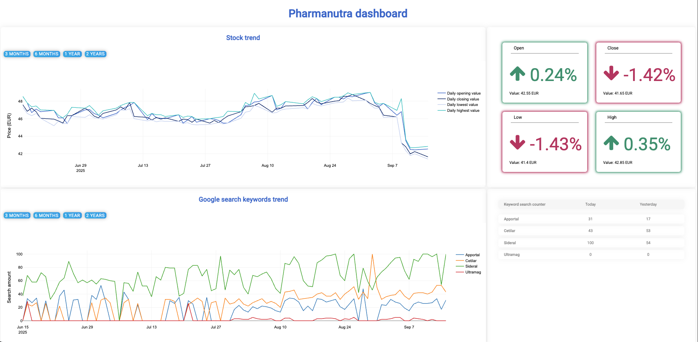

# Pharmanutra Dashboard

## Overview

Pharmanutra Dashboard is a data platform for visualizing stock values and Google keyword trends of Pharmanutra S.p.A., one of the biggest Italian pharmaceutical companies. 
The project features a robust ETL pipeline that collects, processes and loads data into a PostgreSQL database, making it available through a FastAPI backend and interactive dashboard.

## Features

- **ETL Pipeline:** Automated extraction and transformation of stock and keyword trend data using Airflow DAGs.
- **Proxy Rotation:** Smart proxy management to bypass rate limits when querying Google Trends.
- **Backend API:** FastAPI service exposing endpoints for stock values and keyword trends.
- **Frontend Dashboard:** Interactive dashboard for data visualization.
- **Database Integration:** PostgreSQL used for persistent storage and analytics.
- **Configurable & Extensible:** Easily add new keywords, proxies, or data sources.

## Project Structure

```
pharmanutra_dashboard/
├── dags/                   # Airflow DAGs for ETL workflows
├── backend/                # FastAPI backend and API logic
│   └── backend.py          # Main FastAPI application
├── frontend/               # Frontend dashboard (e.g., Typescript app)
│   └── ...                 # Frontend source files
├── sql_scripts/            # SQL scripts and data processing modules for retrieving data manually
│   └── proxy/              # Proxy management utilities
│       └── check_proxy.py  # Proxy list and checker
├── include/                # Additional files for deployment (optional)
├── plugins/                # Custom Airflow plugins (optional)
├── requirements.txt        # Python dependencies
├── Dockerfile              # Container configuration for local and cloud deployment
├── docker-compose.yaml     # PostgreSQL container configuration. (TBU)
├── airflow_settings.yaml   # Airflow connections, variables, and pools
├── .env                    # Environment variables (not tracked in GIT)
├── .env.example            # Example environment configuration
├── .gitignore              # Files and folders excluded from git
└── README.md               # Project documentation
```

## Getting Started

### Prerequisites

- Docker
- Python 3.10+
- Astronomer CLI (for Airflow development)
- PostgreSQL

### Setup

1. **Clone the repository:**
    ```bash
    git clone https://github.com/yourusername/pharmanutra_dashboard.git
    cd pharmanutra_dashboard
    ```

2. **Configure environment variables:**
    - Copy `.env.example` to `.env` and fill in your database and client settings.

3. **Install dependencies:**
    ```bash
    pip install -r requirements.txt
    ```

4. **Start Airflow locally:**
    ```bash
    astro dev start
    ```
    This will launch Airflow and all required services in Docker containers.

5. **Run the FastAPI backend:**
    ```bash
    cd backend
    uvicorn backend:app --reload
    ```

6. **Run the frontend dashboard:**
    ```bash
    cd frontend
    # Follow frontend-specific instructions (e.g., npm install && npm start)
    ```

## API Endpoints

- `/stock`: Get stock values for a given date range.
- `/stock/stat`: Get statistical summaries of stock data.
- `/trend`: Get Google keyword trends.
- `/trend/stat`: Get statistical summaries of keyword trend data.

## Demonstration

Here's a simple example of how the dashboard looks like:


## Contributing

Contributions are welcome! Please open issues or submit pull requests for improvements, bug fixes, or new features.

## License

This project is licensed under the MIT License.

## Contact

For questions or support, please contact the maintainer.
